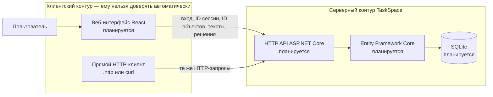

# Модель угроз

Эта модель относится к **TaskSpace**. Как устроен продукт и какие данные в нём важны, описано в [PROJECT.md](PROJECT.md). Требования безопасности и критерии их проверки — в [security-requirements.md](security-requirements.md).

## Как устроен продукт

Пользователь сможет работать через React-интерфейс или посылать запросы в API напрямую. Для сервера это одинаково недоверенный клиент: он может изменить любой параметр, скрыть его или повторить запрос.

В API входят:

- данные для входа и идентификатор сессии;
- идентификаторы команды, задачи и участников;
- название и описание задачи, текст сдачи и замечание;
- действие автора: принять результат или вернуть его на доработку.

Сервер по действующей сессии определяет пользователя, проверяет его членство в команде и роль в задаче, а затем решает, можно ли выполнить действие. Веб-интерфейс к SQLite не обращается: с базой через Entity Framework Core работает только сервер.

**Что есть сейчас:** паспорт проекта, требования безопасности и эта модель. Исходного кода и запускаемой версии в публичном репозитории пока нет.

**Что планируется:** сервер ASP.NET Core, Entity Framework Core, SQLite и React-интерфейс. Точные HTTP-маршруты и способ хранения идентификатора сессии команда ещё не выбрала.

**Важные допущения:**

- Первая версия запускается локально. Публикация API в недоверенную сеть и доступ других пользователей ОС к файлу SQLite пока не входят в границу продукта.
- Ограничения в React не считаются защитой: сервер всё равно проверяет каждый запрос.
- Текстовые поля не поддерживают HTML и Markdown. Если React останется в продукте, он показывает их как обычный текст согласно SR-11.
- Конкретные механизмы защиты для SR-01, SR-09, SR-10 и SR-11 команда выберет на S04.

## Граница доверия

| Граница                | Что через неё проходит                                                                                                        | Почему сервер это проверяет                                                                                                                                                       |
| ---------------------- | ----------------------------------------------------------------------------------------------------------------------------- | --------------------------------------------------------------------------------------------------------------------------------------------------------------------------------- |
| TB-01: клиент → сервер | Данные для входа, идентификатор сессии, ID команды, задачи и участников, параметры просмотра, текстовые поля и решения автора | Любой из этих параметров можно изменить в прямом HTTP-запросе. Сервер сам устанавливает пользователя по сессии, проверяет доступ к команде, роль в задаче и её текущее состояние. |

Сервер и SQLite находятся в одном локальном контуре. Если продукт начнут запускать на общей машине или публиковать в сети, модель нужно дополнить новой границей и угрозами.

## Что защищаем

Подробный список есть в [разделе 5 паспорта](PROJECT.md#5-значимые-данные-и-другие-объекты). Здесь важнее всего следующее:

- нельзя работать от имени другого пользователя;
- участник одной команды не должен видеть задачи и результаты другой;
- у задачи должны оставаться правильные автор, исполнитель и состояние;
- сдачи и решения нельзя подменить, потерять или выполнить как код в браузере другого участника.

## Угрозы

| ID   | Сценарий                                                                                                                                                                                                                                              | Что ломается                                                               | Где возникает                                | Связанные SR                      | Приоритет и почему                                                                                                                                          |
| ---- | ----------------------------------------------------------------------------------------------------------------------------------------------------------------------------------------------------------------------------------------------------- | -------------------------------------------------------------------------- | -------------------------------------------- | --------------------------------- | ----------------------------------------------------------------------------------------------------------------------------------------------------------- |
| T-01 | Посторонний подставляет отсутствующий, изменённый, угаданный или чужой идентификатор сессии. Если сервер принимает его за настоящую сессию, человек получает доступ к чужим данным и меняет задачи от имени владельца.                                | Идентичность пользователя, конфиденциальность и целостность данных команд. | TB-01; любой защищённый запрос.              | SR-01, SR-09                      | **Высокий.** Такой сбой обходит остальные проверки и затрагивает все сценарии.                                                                              |
| T-02 | Участник команды A знает ID команды, задачи, сдачи или решения команды B и подставляет его в запрос просмотра. Если сервер проверяет только существование ID, он получает чужие данные.                                                               | Изоляция команд и конфиденциальность заданий, сдач и замечаний.            | TB-01; параметры просмотра и ID объектов.    | SR-03                             | **Высокий.** Прямой HTTP-запрос сделать легко, а раскрытие чужой работы для продукта критично.                                                              |
| T-03 | Пользователь подменяет в запросе создания задачи команду, автора или исполнителя. Если сервер берёт эти значения из запроса и не сверяет с сессией и членством, задача появляется в чужой команде или от чужого имени.                                | Принадлежность к команде и достоверность ответственности за задачу.        | TB-01; создание задачи.                      | SR-02, SR-04                      | **Высокий.** Это первый основной сценарий, а подмена полей возможна при прямом вызове API.                                                                  |
| T-04 | Участник команды, который не назначен исполнителем, напрямую отправляет сдачу по чужой задаче. Если сервер полагается на скрытую кнопку в интерфейсе, ложная сдача попадает в историю, а задача уходит на проверку.                                   | Полномочия исполнителя, достоверность сдачи и состояние задачи.            | TB-01; сдача результата.                     | SR-05, SR-08                      | **Высокий.** Можно выдать чужую работу за результат исполнителя в основном сценарии сдачи.                                                                  |
| T-05 | Участник, который не создавал задачу, напрямую отправляет принятие или возврат результата. Если сервер не проверяет автора и состояние задачи, незавершённую работу примут или в истории появится чужое замечание.                                    | Полномочия автора, состояние задачи и история решений.                     | TB-01; принятие или возврат результата.      | SR-06, SR-08                      | **Высокий.** Угроза напрямую ломает сценарии принятия и доработки.                                                                                          |
| T-06 | Исполнитель дважды отправляет сдачу или автор почти одновременно отправляет «принять» и «вернуть». Если сервер отдельно проверяет состояние и отдельно сохраняет результат, могут появиться две сдачи, два разных решения или противоречивая история. | Согласованность переходов, история и состояние принятой задачи.            | TB-01; сдача, принятие и возврат результата. | SR-05, SR-06, SR-07, SR-08, SR-10 | **Средний.** Повторные и параллельные запросы реальны при прямом API и повторной отправке. Они не открывают чужую команду, но портят историю задачи.        |
| T-07 | Участник записывает HTML или JavaScript в название, описание, сдачу или замечание. Если React покажет это как разметку, код выполнится, когда страницу откроет другой участник.                                                                       | Сессия и действия пользователя, который просматривает страницу.            | TB-01; текстовые поля и их вывод в React.    | SR-11                             | **Средний.** Угроза актуальна, пока React остаётся в продукте. Для неё нужно небезопасно отрисовать текст, но последствия затрагивают другого пользователя. |

## Приоритетный набор

Сейчас в приоритете **T-01, T-02, T-03, T-04 и T-05**. Они покрывают вход в систему, разделение команд и ответственность автора и исполнителя во всех трёх основных сценариях.

T-06 и T-07 остаются в модели. T-06 нужно учесть при проектировании переходов состояния. T-07 нужно оставить, если React войдёт в итоговую версию продукта.

